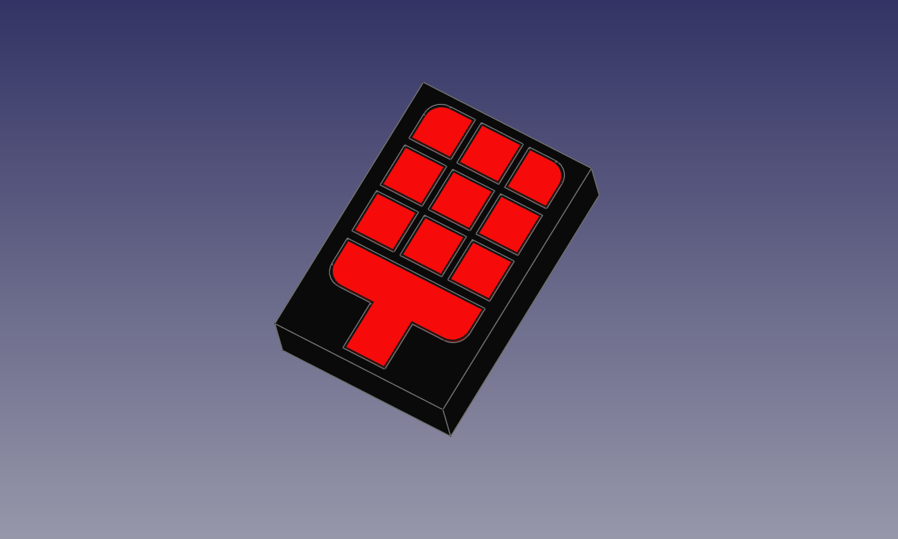

  This 10 Segment Display has 12 2x3x4mm square LED's.
  1.5" High x 1" wide x 3/8" deep.
  
  I did allow tolerances for fitting, however depending on your Printer you may need to adjust
  the temp accordingly if parts fit two tight print them a bit cooler. it will make a huge difference.
  
  Base can be printed out with any color you like.
  Segments were printed with translucent Red with Red LED's
  
  The Display is NOT PCB compliant.
  can be driven by 74HC595 shift register, 8 digits rquire 9 shift registers. 
  
  
